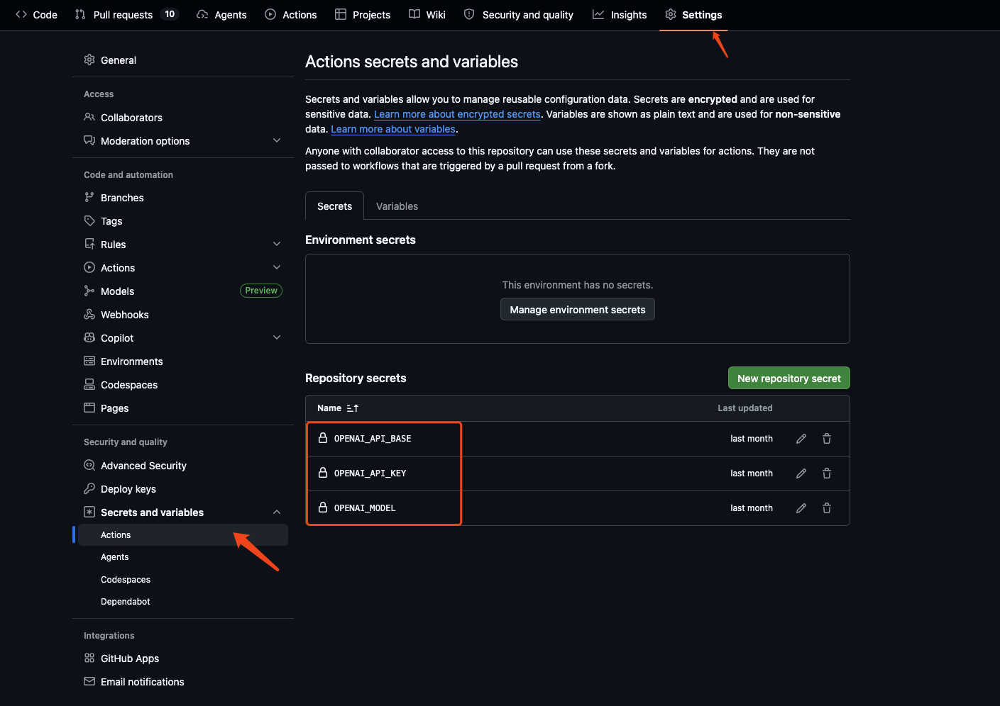
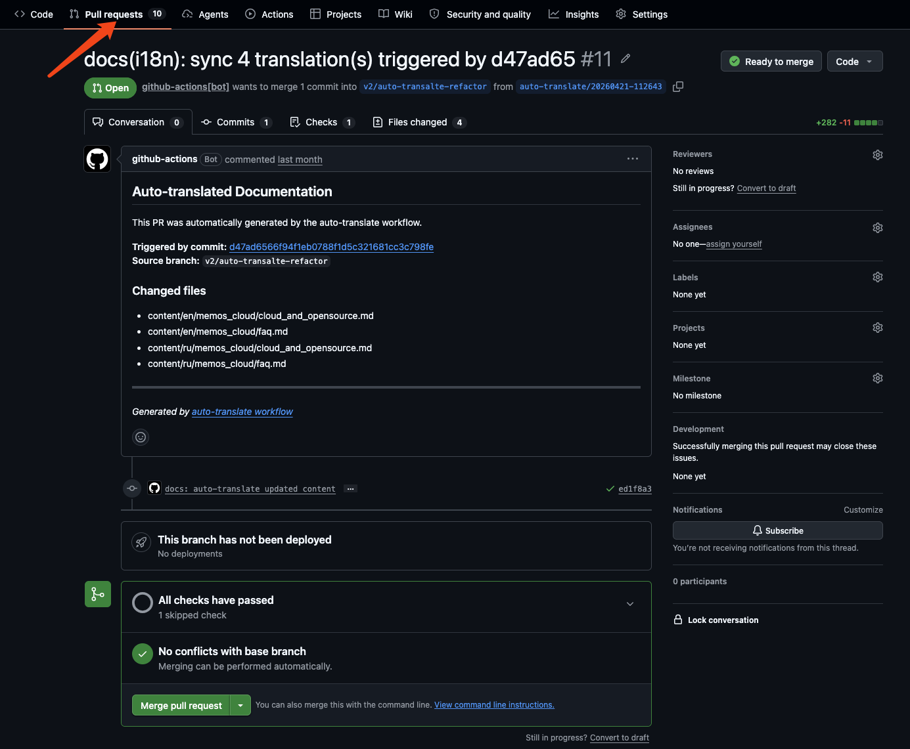

# 文档翻译操作指南

本指南面向负责维护 MemOS 文档的人员，说明如何新增、修改文档内容，以及如何管理翻译语言，所有翻译工作由自动化流程完成，无需手动操作译文文件。

---

## 目录

- [核心原则](#核心原则)
- [目录说明](#目录说明)
- [配置大模型参数](#配置大模型参数)
- [新增、修改和删除文档](#新增、修改和删除文档)
- [修改settings.yml](#修改settings.yml)
- [配置语言](#配置语言)
- [翻译自动触发的时机](#翻译自动触发的时机)
- [翻译 PR 的处理流程](#翻译-pr-的处理流程)

---

## 核心原则

> **只编辑 `content/cn/` 目录下的中文文件，不要直接修改 `content/en/`、`content/ru/` 等译文目录。**

译文目录由自动化流程生成和维护，手动修改后会在下次翻译时被覆盖。如果需要修正某处译文，请在中文源文件中修改对应内容，再由翻译流程重新生成。

---

## 目录说明

```
content/
├── cn/          ✅ 中文源文件，在此编辑
│   ├── settings.yml        # 文档站导航与侧边栏配置
│   ├── memos_cloud/        # 云服务文档
│   ├── open_source/        # 开源项目文档
│   ├── openclaw/           # OpenClaw 文档
│   ├── usecase/            # 使用案例
│   └── ...
│
├── en/          🚫 英文译文，自动生成，请勿直接编辑
├── ru/          🚫 俄文译文，自动生成，请勿直接编辑
└── ja/          🚫 日文译文，自动生成，请勿直接编辑
```

---

## 配置大模型参数

翻译流程依赖 LLM 服务完成实际翻译，相关凭证通过 GitHub Secrets 配置，无需写入代码或文件。

### 在哪里配置

进入仓库页面 → **Settings** → **Secrets and variables** → **Actions** → **New repository secret**，逐一添加以下条目。



### 配置项说明

| Secret 名称 | 是否必填 | 说明 |
|-------------|:-------:|------|
| `OPENAI_API_KEY` | ✅ 必填 | LLM 服务的 API Key，缺少此项时翻译流程会直接报错停止 |
| `OPENAI_API_BASE` | 选填 | LLM 服务的接口地址，默认值：`https://api-int.memtensor.cn/v1` |
| `OPENAI_MODEL` | 选填 | 使用的模型名称，默认值： `gpt-4o` |

### 配置步骤

1. 打开仓库 **Settings → Secrets and variables → Actions**
2. 点击 **New repository secret**
3. **Name** 填写 Secret 名称（如 `OPENAI_API_KEY`），**Secret** 填写对应值
4. 点击 **Add secret** 保存
5. 重复以上步骤添加其余条目

> 💡 Secret 保存后无法查看具体内容，只能覆盖更新。如需更换 API Key，直接点击对应条目的 **Update** 重新填写即可。

---

## 新增、修改和删除文档

### 修改已有文档

直接编辑 `content/cn/` 下对应的 `.md` 文件，提交并推送到仓库即可。

```
修改 content/cn/memos_cloud/quick_start.md
    ↓
git add + git commit + git push
    ↓
GitHub Actions 自动检测到变更，触发翻译
    ↓
数分钟后，自动创建包含译文更新的 Pull Request
```

### 新增文档

1. 在 `content/cn/` 对应目录下创建新的 `.md` 文件，用中文编写内容。
2. 在 `content/cn/settings.yml` 的 `nav` 部分添加该文件的导航条目（见下一节）。
3. 提交并推送，翻译流程会自动处理新文件。

### 删除文档

直接删除 `content/cn/` 下的 `.md` 文件并推送。翻译流程会自动检测到删除操作，并同步删除所有语言对应的译文文件。

---

## 修改settings.yml

文档站的导航结构由 `content/cn/settings.yml` 控制。修改此文件并推送后，翻译流程会自动同步更新各语言版本的 `settings.yml`。

### 添加导航条目示例

```yaml
# content/cn/settings.yml
nav:
  - "(ri:cloud-line) MemOS 云服务":
    - "(ri:book-line) 开始使用":
      - "(ri:eye-line) 概览": memos_cloud/overview.md
      - "(ri:rocket-line) 快速开始": memos_cloud/quick_start.md
      # 在此添加新条目：
      - "(ri:flag-line) 新功能介绍": memos_cloud/new_feature.md
```

**注意事项：**
- 图标使用 `(ri:图标名)` 格式，可在 [icones.js.org](https://icones.js.org/) 查找可用图标名
- 文件路径相对于 `content/cn/` 目录
- 修改 `settings.yml` 后同样会触发自动翻译

---

## 配置语言

当前翻译目标语言在以下文件中配置：

**`scripts/auto-translate/languages.json`**

```json
["en"]
```

### 新增一门语言

1. 编辑 `scripts/auto-translate/languages.json`，添加语言代码：

   ```json
   ["en", "ja"]
   ```

2. 提交并推送：

   ```bash
   git add scripts/auto-translate/languages.json
   git commit -m "feat: add Japanese translation"
   git push
   ```

3. 系统检测到新增语言后，会自动对 **所有现有中文文档** 进行一次全量翻译，在 `content/ja/` 目录下生成完整的日文译文，并创建 PR。

   > ⚠️ 全量翻译文件数量较多时，PR 可能需要较长时间才会出现，请耐心等待。

### 删除一门语言

1. 编辑 `scripts/auto-translate/languages.json`，移除对应语言代码：

   ```json
   ["en"]
   ```

2. 提交并推送后，系统会自动删除该语言对应的整个 `content/<lang>/` 目录，并创建 PR。

**支持的语言代码参考：**

| 代码 | 语言 | 代码 | 语言 |
|------|------|------|------|
| `en` | 英语 | `ko` | 韩语 |
| `ru` | 俄语 | `fr` | 法语 |
| `ja` | 日语 | `de` | 德语 |
| `zh` | 中文 | `es` | 西班牙语 |

---

## 翻译自动触发的时机

推送代码后，只要变更内容命中以下任一路径，GitHub Actions 会自动启动翻译流程：

| 变更内容 | 触发翻译 |
|---------|---------|
| 修改 `content/cn/` 下任意 `.md` 文件 | ✅ |
| 新增 `content/cn/` 下 `.md` 文件 | ✅ |
| 删除 `content/cn/` 下 `.md` 文件 | ✅（同步删除译文） |
| 修改 `content/cn/settings.yml` | ✅ |
| 修改 `scripts/auto-translate/languages.json` | ✅ |
| 修改其他文件（代码、配置等） | ❌ 不触发 |

**增量机制：** 每次只翻译本次推送中实际变更的文件，未改动的文件不会重复翻译，通常几分钟内即可完成。

### 配置触发分支

默认情况下，所有分支的推送只要命中上述路径就会触发翻译。如需限定只在特定分支上触发，编辑以下文件：

**`.github/workflows/auto-translate.yml`**

在 `push` 下添加 `branches` 字段：

```yaml
on:
  push:
    branches:
      - main
      - v2
    paths:
      - 'content/cn/**.md'
      - 'content/cn/settings.yml'
      - 'scripts/auto-translate/languages.json'
```

也可以用 `branches-ignore` 排除某些分支，其余分支均正常触发：

```yaml
on:
  push:
    branches-ignore:
      - 'dev'
      - 'feature/**'
    paths:
      - ...
```

> 💡 `branches` 与 `paths` 是 **AND** 关系，推送必须同时满足分支匹配和路径匹配才会触发。修改此文件本身不会触发翻译。

---

## 翻译 PR 的处理流程

翻译完成后，系统会自动创建一个 Pull Request，标题格式为：

```
docs(i18n): sync N translation(s) triggered by <commit-sha>
```



### 审核要点

打开 PR 后，建议检查以下几点：

- [ ] **文件数量是否符合预期**：PR 描述中列出了本次更新的译文文件列表，核对是否与你修改的中文文档对应
- [ ] **术语是否保留原文**：`MemOS`、`MemCube`、`LLM`、`API` 等专有术语不应被翻译
- [ ] **代码块是否完整**：代码示例、命令、参数名应与中文原文一致
- [ ] **链接是否正常**：文档内链接路径不应被修改

### 合并 PR

确认译文无误后，直接 Merge 即可。如发现译文问题，**不要在 PR 中直接修改译文文件**，而是：

1. 关闭该 PR
2. 修改 `content/cn/` 中对应的中文源文件
3. 推送后重新触发翻译
